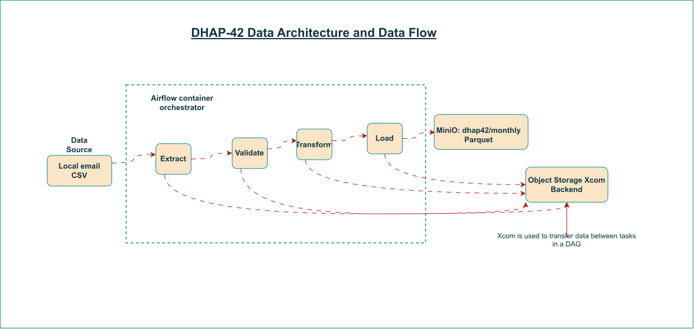
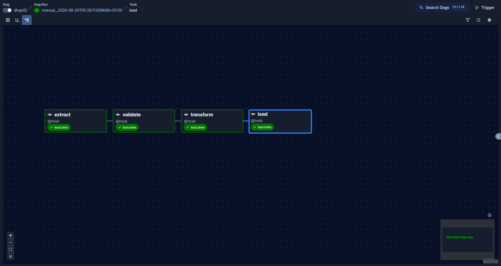
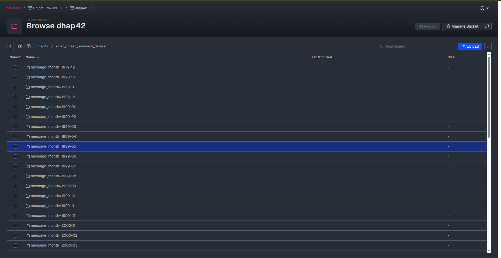

# DHAP-42 — Local CSV to MinIO Parquet Pipeline

An Apache Airflow pipeline that reads the email dataset from **DHAP-34**, validates a YAML schema contract, derives monthly partitions, and uploads Parquet files to **MinIO's S3-compatible object storage**. Four TaskFlow tasks exchange DataFrames through Airflow's **Object Storage XCom Backend**, with a dedicated MinIO bucket for large intermediate results.

The ingestion code, Docker environment, schema validation, partitioned output, and object-storage XCom configuration are implemented. The inspected task logs for the local run beginning **2026-09-30 at 00:28:11 UTC** record **21,684 rows uploaded in 47 Parquet files**. This is evidence from the task logs; the verification commands below check the current deployed state.

## Contents

- [DHAP-42 — Local CSV to MinIO Parquet Pipeline](#dhap-42--local-csv-to-minio-parquet-pipeline)
  - [Contents](#contents)
  - [Architecture and project layout](#architecture-and-project-layout)
    - [Technology versions](#technology-versions)
    - [Repository layout](#repository-layout)
  - [Dataset and schema validation](#dataset-and-schema-validation)
  - [DAG and task behavior](#dag-and-task-behavior)
  - [S3-backed XCom: passing DataFrames between tasks](#s3-backed-xcom-passing-dataframes-between-tasks)
    - [Configuration](#configuration)
    - [What happens between tasks](#what-happens-between-tasks)
    - [Why this project uses it](#why-this-project-uses-it)
  - [Final Parquet output](#final-parquet-output)
  - [Setup and startup](#setup-and-startup)
    - [Prerequisites](#prerequisites)
    - [1. Supply the CSV, environment and license](#1-supply-the-csv-environment-and-license)
    - [2. Validate and start](#2-validate-and-start)
      - [Expected Results:](#expected-results)
    - [3. Check services and mounts](#3-check-services-and-mounts)
  - [Run and verify the pipeline](#run-and-verify-the-pipeline)
    - [1. Check DAG discovery](#1-check-dag-discovery)
    - [2. Verify the XCom backend and bucket access](#2-verify-the-xcom-backend-and-bucket-access)
    - [3. Trigger a run](#3-trigger-a-run)
    - [4. Exercise contract rejection without uploading](#4-exercise-contract-rejection-without-uploading)
  - [Operations and troubleshooting](#operations-and-troubleshooting)
    - [Logging and persistence](#logging-and-persistence)
    - [Common issues](#common-issues)
  - [Implementation boundaries](#implementation-boundaries)
  - [References](#references)

## Architecture and project layout

  

The arrows between tasks represent dependencies and TaskFlow arguments. Airflow resolves those arguments through XCom when each downstream task starts. Intermediate results and final output have separate storage locations:

| Storage | Purpose |
| --- | --- |
| MinIO bucket `dhap42` | Final monthly Parquet dataset; the actual bucket is selected by `MINIO_BUCKET`. |
| MinIO bucket `dhap42-xcom`, prefix `xcom/` | Large serialized task return values used for communication between tasks. |
| PostgreSQL | Airflow metadata, XCom records containing small values or object references, and Celery result-backend data. |
| Redis | Celery's task message broker. |

Airflow and MinIO run in separate Compose projects connected to the external Docker network **`dhap42`**. Airflow uses `CeleryExecutor`, with API server, scheduler, DAG processor, worker, triggerer, PostgreSQL, Redis, and an initialization service. MinIO has a server and a one-shot bucket initializer. Optional Airflow `debug` and `flower` profiles are available but are not started by `make up`.

### Technology versions

| Component | Repository configuration |
| --- | --- |
| Apache Airflow | `apache/airflow:3.3.2` |
| Amazon provider / S3 filesystem support | `apache-airflow-providers-amazon[s3fs]==9.37.0` |
| Common I/O provider / XCom backend | `apache-airflow-providers-common-io==1.9.0` |
| pandas | `3.0.6` |
| PyArrow | `25.0.1` |
| PyYAML | `6.0.3` |
| PostgreSQL | `postgres:16` |
| Redis | `redis:7.2-bookworm` |
| MinIO AIStor server | `quay.io/minio/aistor/minio:latest` |
| MinIO AIStor client | `quay.io/minio/aistor/mc:RELEASE.2026-02-07T19-37-38Z` |

Airflow 3.x is the accepted implementation target for this project; the original brief listed Airflow 2.x. The Dockerfile installs the requirements while retaining the Airflow version supplied by its base image. The complete dependency list is in `requirements.txt`; some container tags remain mutable rather than digest-pinned.

### Repository layout

```text
DHAP-42/
├── .env.example
├── .env                              # Local credentials/configuration; ignored
├── .gitignore
├── Makefile
├── README.md
├── manifest.yaml
├── schema_contract.yaml
├── requirements.txt
├── dataset/
│   └── email_thread_details.csv       # Local input; ignored by Git
├── etl/
│   ├── __init__.py
│   ├── extract.py                    # Manifest loading and CSV extraction
│   ├── validate.py                   # Contract checks and type conversion
│   ├── transform.py                  # Derive message_month
│   └── load.py                       # Write Parquet and upload through S3Hook
├── utils/
│   ├── __init__.py
│   └── logging_config.py
└── containers/
    ├── airflow/
    │   ├── Dockerfile
    │   ├── docker-compose.yaml
    │   ├── dags/dhap42.py             # Four-task DAG
    │   ├── logs/                     # Runtime logs
    │   ├── config/
    │   └── plugins/
    └── minio/
        ├── docker-compose.yaml
        ├── minio.license             # Supplied locally; ignored
        └── minio_data/               # Persistent object data; ignored
```

Commands in this README run from the **DHAP-42 project root**, where the Makefile is located. Paths are relative to that directory unless explicitly identified as container paths. Runtime directories may be created during startup.

## Dataset and schema validation

`manifest.yaml` identifies `email_thread_summary_dataset`, version `1`, owned by `mfonekpo`. It records SharePoint as the original source and points to the local CSV through `source.file_path`, using `utf-8-sig` encoding. The manifest's metadata status remains `draft`; it is not a switch that disables DAG execution.

The current input contains **21,684 rows, six columns, and 4,167 distinct thread IDs**. Its timestamps cover **47 distinct months**. Multiple messages can belong to the same thread, so repeated `thread_id` values are retained.

| Input column | Contract type | Nullable | Validated representation |
| --- | --- | --- | --- |
| `thread_id` | `integer` | No | pandas nullable `Int64` |
| `subject` | `string` | Yes | pandas string |
| `timestamp` | `datetime` | No | pandas datetime |
| `from` | `string` | No | pandas string |
| `to` | `string` | No | pandas string |
| `body` | `string` | Yes | pandas string |

The extractor resolves the default manifest relative to the project location, then resolves `source.file_path` relative to the manifest. It preserves CSV values as text, disables pandas' default NA-token conversion, and rejects an empty DataFrame.

The validator enforces these rules:

- All six declared columns must exist, including nullable columns. `allow_extra_columns: false` rejects unexpected names.
- Null values and empty or whitespace-only strings count as missing. Required columns cannot contain them. Literal text such as `NA` is not automatically treated as missing.
- Integer values must match a whole-number representation and fit the signed 64-bit range. Decimal strings, scientific notation, underscores, and surrounding spaces are rejected without rounding.
- Timestamps must parse as ISO 8601. They must be all timezone-naive or all timezone-aware with a consistent UTC offset. The existing naive timestamps remain naive; validation does not assume UTC. A nonempty literal `NaT` is rejected.
- Contract column names must be unique, types must be supported, and `nullable` and `allow_extra_columns` must be actual YAML booleans.

Validation returns a typed copy and raises `ContractValidationError` on a mismatch. It does not impose unique thread IDs or validate email-address syntax. The derived `message_month` column belongs to the output, so it is not added to the six-column input contract.

## DAG and task behavior

The DAG is defined in `containers/airflow/dags/dhap42.py` using `from airflow.sdk import task, dag`.

```text
extract → validate → transform → load
```

| Setting | Current value |
| --- | --- |
| DAG ID | `dhap42` |
| Schedule | `None` — manually triggered |
| Start date | `2026-09-29`, UTC |
| Catchup | `False` |
| Paused on initial creation | `False` in the DAG definition |
| Maximum active runs | `3` |
| Retries | `2` per task; no explicit retry delay is set in this DAG |

An existing DAG retains its UI pause state. The DAG-level initial pause setting differs from the Compose-wide default for newly discovered DAGs.

| Task ID | Function | Work performed | Return value |
| --- | --- | --- | --- |
| `extract` | `read_data()` | Load the manifest and read the CSV. | Raw text DataFrame. |
| `validate` | `validate_contract(dataframe)` | Check columns, nullability and types. | Validated, typed DataFrame. |
| `transform` | `transform_data(validated_dataframe)` | Copy records and derive `message_month` using `%Y-%m`. | Seven-column DataFrame. |
| `load` | `load_to_minio(dataframe)` | Stage monthly Parquet files and upload them. | Dictionary containing bucket, prefix, row count and file count. |

ETL imports occur inside task functions, and CSV access and uploads happen during task execution. The DAG currently imports pandas at module scope for the load task's type annotation.

The default task dependency behavior prevents `transform` and `load` from running when validation fails. Consequently, that run cannot publish final dataset Parquet through `load`. **The preceding extraction task can already have written an intermediate XCom object**; schema validation happens after extraction and its XCom publication.

## S3-backed XCom: passing DataFrames between tasks

### Configuration

The shared Airflow environment in `containers/airflow/docker-compose.yaml` contains:

```yaml
AIRFLOW__CORE__XCOM_BACKEND: airflow.providers.common.io.xcom.backend.XComObjectStorageBackend
AIRFLOW__COMMON_IO__XCOM_OBJECTSTORAGE_PATH: s3://minio_s3@dhap42-xcom/xcom
AIRFLOW__COMMON_IO__XCOM_OBJECTSTORAGE_THRESHOLD: "1048576"
AIRFLOW__COMMON_IO__XCOM_OBJECTSTORAGE_COMPRESSION: gzip
```

The URI identifies:

| Part | Meaning |
| --- | --- |
| `s3://` | Use the S3 protocol supported by MinIO. |
| `minio_s3@` | Resolve the Airflow connection named `minio_s3`; this is a connection ID, not a username/password embedded in the URI. |
| `dhap42-xcom` | Dedicated bucket for intermediate XCom payloads. |
| `/xcom` | Prefix within that bucket. |

The common-I/O provider supplies the backend; the Amazon provider's `s3fs` extra supplies S3 filesystem support. The connection points to `http://minio:9000`, so these objects reside on the local MinIO server, not on an AWS-hosted bucket.

### What happens between tasks

TaskFlow automatically publishes task returns under the `return_value` XCom key and resolves downstream arguments. For this backend, the threshold is measured against **serialized UTF-8 JSON bytes before gzip compression**:

1. A value **smaller than 1,048,576 bytes (1 MiB)** stays in Airflow's metadata database.
2. A value **at or above 1 MiB** is written to object storage with gzip compression; the database keeps its reference.
3. The backend retrieves and deserializes a referenced payload for the consuming task.

The first three tasks return DataFrames; the final task returns a small summary that normally remains in the database. This is a hybrid backend: configuring S3 does not force every XCom into the bucket. See the [backend guide](https://airflow.apache.org/docs/apache-airflow-providers-common-io/stable/xcom_backend.html) and [provider implementation](https://airflow.apache.org/docs/apache-airflow-providers-common-io/stable/_modules/airflow/providers/common/io/xcom/backend.html) for the threshold and serialization behavior.

Backend-managed keys have this general form:

```text
dhap42-xcom/
└── xcom/
    └── dhap42/
        └── <run_id>/
            └── <task_id>/
                └── <generated-uuid>.gz
```

These objects contain serialized XCom payloads. They are separate from the queryable monthly Parquet output and should not be treated as another copy of the final dataset layout.

### Why this project uses it

The four-task design needs to transfer complete DataFrames between independently executed Celery tasks. Object storage keeps large payloads out of PostgreSQL while preserving the existing Python function interfaces. No manually shared temporary directory or explicit `xcom_push()`/`xcom_pull()` calls are needed in this DAG.

Each task still loads its DataFrame into memory, and serialization and network transfer still have costs. This configuration does not make processing streaming or remove worker memory requirements.

The repository configures no XCom-bucket lifecycle policy or success-time cleanup task. Keep referenced objects available while runs, retries, or downstream tasks need them; do not empty `dhap42-xcom` as a routine troubleshooting step. Retention should be coordinated with Airflow metadata and run-history cleanup.

## Final Parquet output

The loader defaults to dataset prefix `email_thread_summary_dataset/` and reads its destination bucket from `MINIO_BUCKET`. With the example environment, objects follow this layout:

```text
dhap42/
└── email_thread_summary_dataset/
    └── message_month=YYYY-MM/
        └── part-00000.parquet
```

The transform derives the month from each record's existing timestamp without a timezone conversion. For the current input, monthly partitioning creates **47 groups**, compared with 932 daily groups.

The loader:

1. Verifies partition values are non-null, use `YYYY-MM`, and match each row's timestamp.
2. Checks access to the existing bucket using `S3Hook(aws_conn_id="minio_s3")`.
3. Writes one file per month into a temporary directory using PyArrow, Snappy compression and `index=False`.
4. Finishes serializing all groups before uploading any final object.
5. Uploads with `replace=True`, then removes the temporary directory.

`message_month` is encoded in the Hive-style directory name and omitted inside each file. A standalone file contains the six source columns; a dataset reader configured with Hive partition discovery reconstructs the seventh column. Snappy compression for these Parquet files is separate from gzip compression for XCom payloads.

A successful load of the current dataset returns:

```json
{
  "bucket": "dhap42",
  "prefix": "email_thread_summary_dataset/",
  "rows": 21684,
  "files": 47
}
```

Rerunning the same full CSV replaces the same final object keys. Uploading multiple files is not an atomic transaction: a failed upload can leave a partial set until a retry completes. Months absent from a later CSV are not automatically deleted. Because the DAG permits three active runs and uses shared output keys, avoid overlapping manual runs with different source contents.

## Setup and startup

### Prerequisites

- Docker Engine or Docker Desktop with Docker Compose v2, and GNU Make.
- Network access for image and dependency downloads.
- Available host ports `8080`, `9000` and `9001`.
- A valid MinIO AIStor license. See the [AIStor container installation guide](https://docs.min.io/aistor/installation/container/install/).
- The CSV from DHAP-34. `dataset/` is ignored by Git, so a fresh clone must receive the input separately.
- Sufficient Docker resources. The included initializer checks for at least 4 GB RAM, 2 CPUs and 10 GB disk; allow additional capacity for images, DataFrames, XCom objects and output.

The documented workflow uses Python inside Airflow's containers; a host virtual environment is optional.

### 1. Supply the CSV, environment and license

Place the CSV at `dataset/email_thread_details.csv` and the license at `containers/minio/minio.license`. Both must be files, not directories created accidentally by bind mounting missing paths.

For a new checkout, create the local environment file without overwriting an existing one:

```bash
cp -n .env.example .env
```

Fill in `.env`:

| Variable | Purpose |
| --- | --- |
| `FERNET_KEY` | Airflow encryption key. Keep the same value across restarts of an existing installation. |
| `AIRFLOW_UID` | Linux user ID for mounted-file ownership. Containers use group `0`. |
| `MINIO_ROOT_USER` | Local MinIO username. |
| `MINIO_ROOT_PASSWORD` | Local MinIO password; supply a nonempty value of at least eight characters. |
| `MINIO_BUCKET` | Final-output bucket; the template uses `dhap42`. |
| `AWS_ACCESS_KEY_ID` | References `MINIO_ROOT_USER`. |
| `AWS_SECRET_ACCESS_KEY` | References `MINIO_ROOT_PASSWORD`. |
| `AIRFLOW_CONN_MINIO_S3` | Environment-defined Airflow AWS connection with MinIO's endpoint. |
| `MINIO_LICENSE` | For the mounted license, add `MINIO_LICENSE=/minio.license`; this entry is not currently in `.env.example`. |

Obtain the Linux user ID and generate a Fernet key for a new installation:

```bash
id -u

docker run --rm --entrypoint python apache/airflow:3.3.2 \
  -c 'from cryptography.fernet import Fernet; print(Fernet.generate_key().decode())'
```

The connection configuration in the template is:

```dotenv
AWS_ACCESS_KEY_ID=${MINIO_ROOT_USER}
AWS_SECRET_ACCESS_KEY=${MINIO_ROOT_PASSWORD}
AIRFLOW_CONN_MINIO_S3='{"conn_type":"aws","extra":{"endpoint_url":"http://minio:9000","region_name":"us-east-1","config_kwargs":{"s3":{"addressing_style":"path"}}}}'
```

Keep the credential references after the MinIO username/password definitions. The same `minio_s3` connection supports both the loader and XCom storage, using the standard AWS environment credentials and path-style addressing. Environment-defined connections are resolved at runtime and do not appear in the Connections UI or `airflow connections list`.

The current `.gitignore` excludes `.env`, the input dataset, licenses, runtime logs, MinIO data and the host virtual environment. Commit the shareable `.env.example`, not working credentials.

### 2. Validate and start

```bash
make config
make up
```


#### Expected Results:
- Airflow Successful Dag Run


- Minio Bucket showing Objects(Partitioned)
- 

`make config` validates both Compose files without printing resolved credentials. `make up` creates the external network if needed, builds/starts Airflow, then starts MinIO and the bucket initializer. Commands return before every service is necessarily ready.

The initializer waits for a healthy MinIO server and runs `mc mb --ignore-existing` for **both** `${MINIO_BUCKET}` and `dhap42-xcom`. The final bucket name is configurable; the XCom bucket name is currently written explicitly in both the initializer and Airflow's XCom URI.

### 3. Check services and mounts

```bash
docker compose --env-file .env -f containers/airflow/docker-compose.yaml ps -a
docker compose --env-file .env -f containers/minio/docker-compose.yaml ps -a
```

Long-running services should be running and healthy where a healthcheck is configured. `airflow-init` and `minio_bucket-init` are one-shot services; `Exited (0)` is their expected successful state.

| Service | Host address |
| --- | --- |
| Airflow UI | [http://localhost:8080](http://localhost:8080) |
| MinIO console | [http://localhost:9001](http://localhost:9001) |
| MinIO S3 API | `http://localhost:9000` |

Inside the Docker network, S3 clients use **`http://minio:9000`**, not `localhost` or console port `9001`. The initializer defaults to local Airflow UI credentials `airflow` / `airflow`; `_AIRFLOW_WWW_USER_USERNAME` and `_AIRFLOW_WWW_USER_PASSWORD` can customize initial account creation. MinIO console credentials come from `.env`.

| Host path | Airflow container path | Access |
| --- | --- | --- |
| `containers/airflow/dags/` | `/opt/airflow/dags` | Bind mount |
| `containers/airflow/logs/` | `/opt/airflow/logs` | Read/write logs |
| `containers/airflow/config/` | `/opt/airflow/config` | Bind mount |
| `containers/airflow/plugins/` | `/opt/airflow/plugins` | Bind mount |
| `dataset/` | `/opt/dhap42/dataset` | Read-only |
| `etl/` | `/opt/dhap42/etl` | Read-only |
| `utils/` | `/opt/dhap42/utils` | Read-only |
| `manifest.yaml` | `/opt/dhap42/manifest.yaml` | Read-only |
| `schema_contract.yaml` | `/opt/dhap42/schema_contract.yaml` | Read-only |

The shared environment sets `PYTHONPATH=/opt/dhap42`, making `etl` and `utils` importable. Source files are mounted; dependencies are installed into the image. Changing requirements therefore requires a rebuild, which `make up` requests.

## Run and verify the pipeline

### 1. Check DAG discovery

```bash
docker compose --env-file .env -f containers/airflow/docker-compose.yaml \
  exec -T airflow-dag-processor airflow dags list-import-errors
```

Resolve any reported import errors before triggering the DAG. In the Airflow UI, locate **`dhap42`** and verify the graph shows `extract → validate → transform → load`.

### 2. Verify the XCom backend and bucket access

The following check prints only backend configuration and object counts; it does not read message contents or upload objects:

```bash
docker compose --env-file .env -f containers/airflow/docker-compose.yaml \
  exec -T airflow-worker python - <<'PY'
import os
from airflow.configuration import conf
from airflow.sdk.execution_time.xcom import XCom
from airflow.providers.amazon.aws.hooks.s3 import S3Hook

print("XCom class:", XCom.__name__)
for name in (
    "xcom_objectstorage_path",
    "xcom_objectstorage_threshold",
    "xcom_objectstorage_compression",
):
    print(name, conf.get("common.io", name))

client = S3Hook(aws_conn_id="minio_s3").get_conn()
targets = [
    (os.environ["MINIO_BUCKET"], "email_thread_summary_dataset/"),
    ("dhap42-xcom", "xcom/"),
]
for bucket, prefix in targets:
    client.head_bucket(Bucket=bucket)
    pages = client.get_paginator("list_objects_v2").paginate(
        Bucket=bucket, Prefix=prefix
    )
    count = sum(len(page.get("Contents", [])) for page in pages)
    print(f"Accessible: s3://{bucket}/{prefix}; objects={count}")
PY
```

The active class should be `XComObjectStorageBackend`, with threshold `1048576` and compression `gzip`. Object counts can be zero before the first run. The XCom count depends on payload sizes, run history and retries; it is not the same as the final Parquet file count. The generic AWS connection test may use AWS STS, so the explicit S3 bucket check is more appropriate for this MinIO setup.

### 3. Trigger a run

In the Airflow UI, unpause `dhap42` if needed, click **Trigger**, and follow the four tasks. Alternatively:

```bash
docker compose --env-file .env -f containers/airflow/docker-compose.yaml \
  exec -T airflow-scheduler airflow dags trigger dhap42
```

Wait for all four tasks to succeed. The logs should report extraction/validation of 21,684 rows, transformation into 47 monthly groups, and upload of 47 Parquet files for the current input.

In the MinIO console, inspect both buckets:

- **`dhap42`**: `email_thread_summary_dataset/message_month=.../part-00000.parquet` contains the final dataset.
- **`dhap42-xcom`**: `xcom/dhap42/...` contains large intermediate task results when they meet or exceed the configured threshold.

Rerunning the storage check verifies current object counts. Repeated full loads use the same final filenames; XCom storage can contain objects from multiple task instances and runs.

### 4. Exercise contract rejection without uploading

This smoke check calls extraction and validation directly inside the worker. It does not invoke the loader or publish TaskFlow XComs, and does not modify the source CSV:

```bash
docker compose --env-file .env -f containers/airflow/docker-compose.yaml \
  exec -T airflow-worker python - <<'PY'
from etl.extract import read_data
from etl.validate import ContractValidationError, validate_contract

raw = read_data()
validate_contract(raw)
sample = raw.head(2).copy()
bad_type = sample.copy()
bad_type.loc[bad_type.index[0], "thread_id"] = "not-an-integer"
cases = {
    "missing column": sample.drop(columns="timestamp"),
    "renamed column": sample.rename(columns={"timestamp": "sent_at"}),
    "mistyped value": bad_type,
}
for label, frame in cases.items():
    try:
        validate_contract(frame)
    except ContractValidationError:
        print(f"PASS: rejected {label}")
    else:
        raise AssertionError(f"Unexpectedly accepted {label}")
print("Valid input and all contract-rejection checks passed")
PY
```

This verifies function behavior; a failed DAG run is a separate orchestration check. The repository currently has no dedicated automated test suite checked in.

## Operations and troubleshooting

| Command | Purpose |
| --- | --- |
| `make config` | Validate both Compose configurations quietly. |
| `make network` | Ensure the shared network exists. |
| `make up` | Build as needed and start/update both projects. |
| `make down` | Stop/remove containers while retaining persistent data. |

After changing `.env`, provider versions or XCom settings, run `make config` and `make up`. A plain container restart does not reload changed environment values. Both Compose projects use their own file-relative bind paths; the Makefile deliberately starts them separately.

### Logging and persistence

Use the Airflow UI for each task's logs. Host task logs live beneath `containers/airflow/logs/dag_id=dhap42/`. The custom logger also creates `logs/pipeline.log` for INFO+ messages and `logs/monitoring.log` for ERROR+ messages, relative to the process working directory; in the standard Airflow working directory these are inside `/opt/airflow/logs`.

```bash
docker compose --env-file .env -f containers/airflow/docker-compose.yaml \
  logs --tail=100 airflow-worker airflow-scheduler airflow-dag-processor

docker compose --env-file .env -f containers/minio/docker-compose.yaml \
  logs --tail=100 minio minio_bucket-init
```

PostgreSQL metadata persists in the `postgres-db-volume` named volume. Both MinIO buckets persist under `containers/minio/minio_data/`, mounted at `/data`. `make down` does not delete these stores or the external network. Loader temporary files are cleaned up separately and are not its persistent output.

### Common issues

| Symptom | Check |
| --- | --- |
| Missing input on a fresh clone | Supply the CSV separately; `dataset/` is ignored by Git. Check `source.file_path` and the read-only mount. |
| `ModuleNotFoundError: etl` or `utils` | Check `PYTHONPATH=/opt/dhap42` and the shared mounts, then recreate affected services. |
| Missing PyArrow, S3 filesystem, or backend class | Confirm the pinned PyArrow, common-I/O and Amazon `[s3fs]` dependencies are installed in the rebuilt Airflow image. |
| DataFrame serialization/deserialization fails | Confirm the same image/dependencies and XCom settings across Airflow services, and access to the referenced XCom objects. |
| `NoSuchBucket` for XCom | Ensure `minio_bucket-init` completed and `dhap42-xcom` exists. Both buckets are required. |
| S3 access denied | Check the running services' MinIO/AWS credential configuration and the `minio_s3` endpoint. |
| Connection absent from the Airflow UI | Expected for `AIRFLOW_CONN_MINIO_S3`; use the worker's S3 access check. |
| MinIO cannot be reached from Airflow | Check the shared `dhap42` network and endpoint `http://minio:9000`. |
| MinIO license/startup error | Check the local license file, its mount and `MINIO_LICENSE=/minio.license`. |
| Fernet or user configuration error | Keep Compose interpolation: `${FERNET_KEY}` and `${AIRFLOW_UID:-50000}:0`, rather than literal variable names. |
| Validation task fails | Read the reported column/rule, correct the source or contract deliberately, then rerun. Downstream tasks require validation success. |
| Custom log-file permission error | Ensure the process working directory's `logs/` location is writable; the custom logger opens files on import. |
| Partial final output after a failed upload | Inspect the load failure and retry the same input; completed objects are overwritten at the same keys. |

## Implementation boundaries

These details describe the current code and matter when adapting the project:

- **Configuration references:** the validator currently always reads its project-root default `schema_contract.yaml`; its `contract_path` argument and the manifest's `schema_path` do not select a different contract in the DAG. The loader likewise defaults to the literal dataset prefix `email_thread_summary_dataset`, rather than reading the manifest's dataset name. Keep these values aligned when renaming or relocating a dataset.
- **Concurrent runs:** `max_active_runs=3` permits overlapping runs, while final object keys are shared. Run sequentially when changing input; the loader does not isolate output by run ID.
- **Retention and replacement:** output replacement applies only to keys written by the current run. There is no obsolete-partition removal, atomic dataset publication, or configured XCom lifecycle policy.
- **Scale:** CSV extraction, validation, transformation and XCom serialization operate on complete in-memory DataFrames. Monthly partitioning improves the output layout but does not bound task memory usage.
- **CSV checks:** the extractor uses pandas with `on_bad_lines="error"`; it does not implement an independent field-count check for every raw CSV record. Schema enforcement applies to the resulting DataFrame.

## References

- [Airflow TaskFlow tutorial](https://airflow.apache.org/docs/apache-airflow/3.3.2/tutorial/taskflow.html)
- [Airflow XCom concepts](https://airflow.apache.org/docs/apache-airflow/3.3.2/core-concepts/xcoms.html)
- [Object Storage XCom Backend](https://airflow.apache.org/docs/apache-airflow-providers-common-io/stable/xcom_backend.html)
- [Amazon provider connection configuration](https://airflow.apache.org/docs/apache-airflow-providers-amazon/stable/connections/aws.html)
- [Docker Compose environment interpolation](https://docs.docker.com/compose/how-tos/environment-variables/variable-interpolation/)
- [Docker Compose networking](https://docs.docker.com/compose/how-tos/networking/)
- [MinIO AIStor container installation](https://docs.min.io/aistor/installation/container/install/)
- [MinIO AIStor license setting](https://docs.min.io/aistor/reference/aistor-server/settings/core/#minio-aistor-license)
